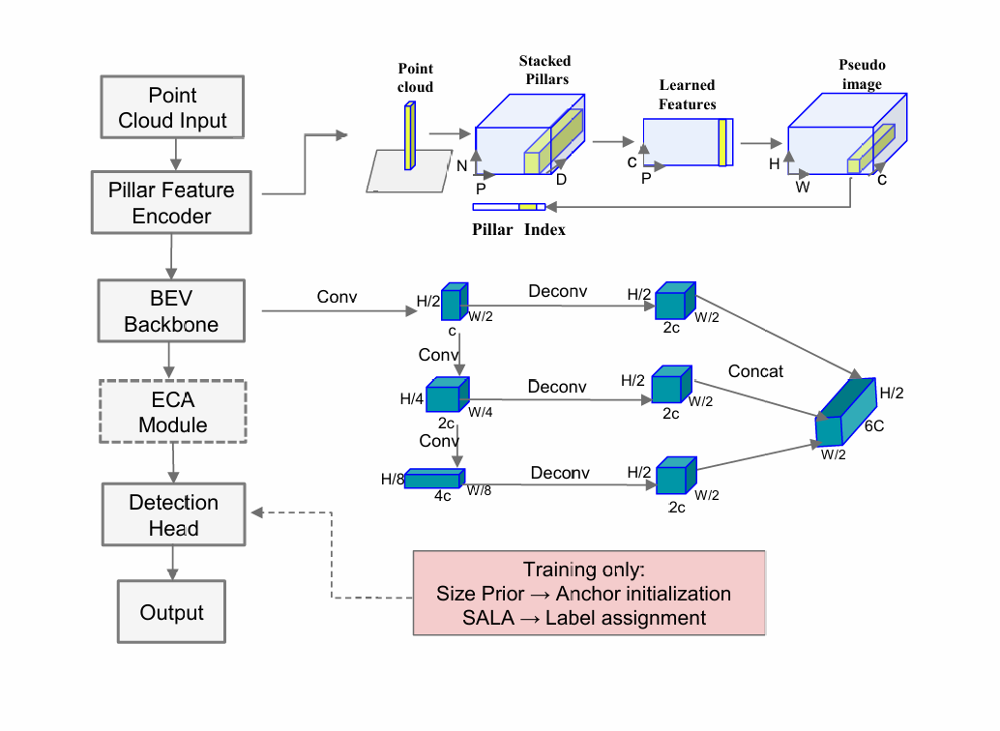
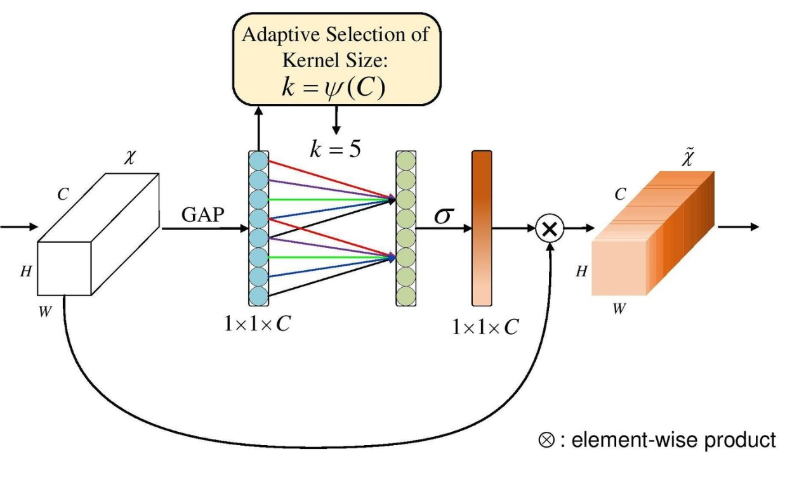
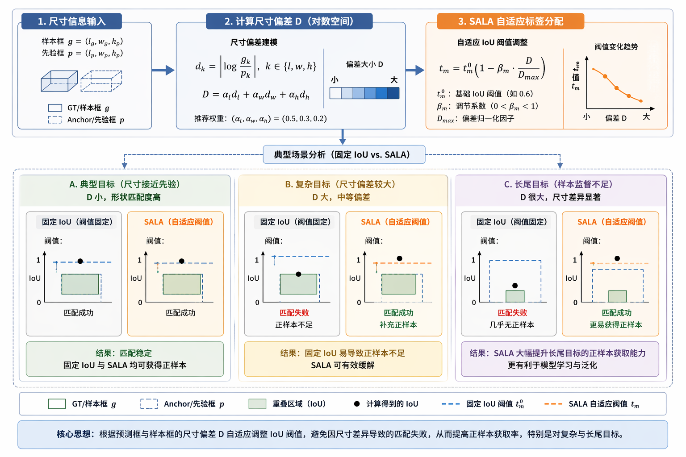
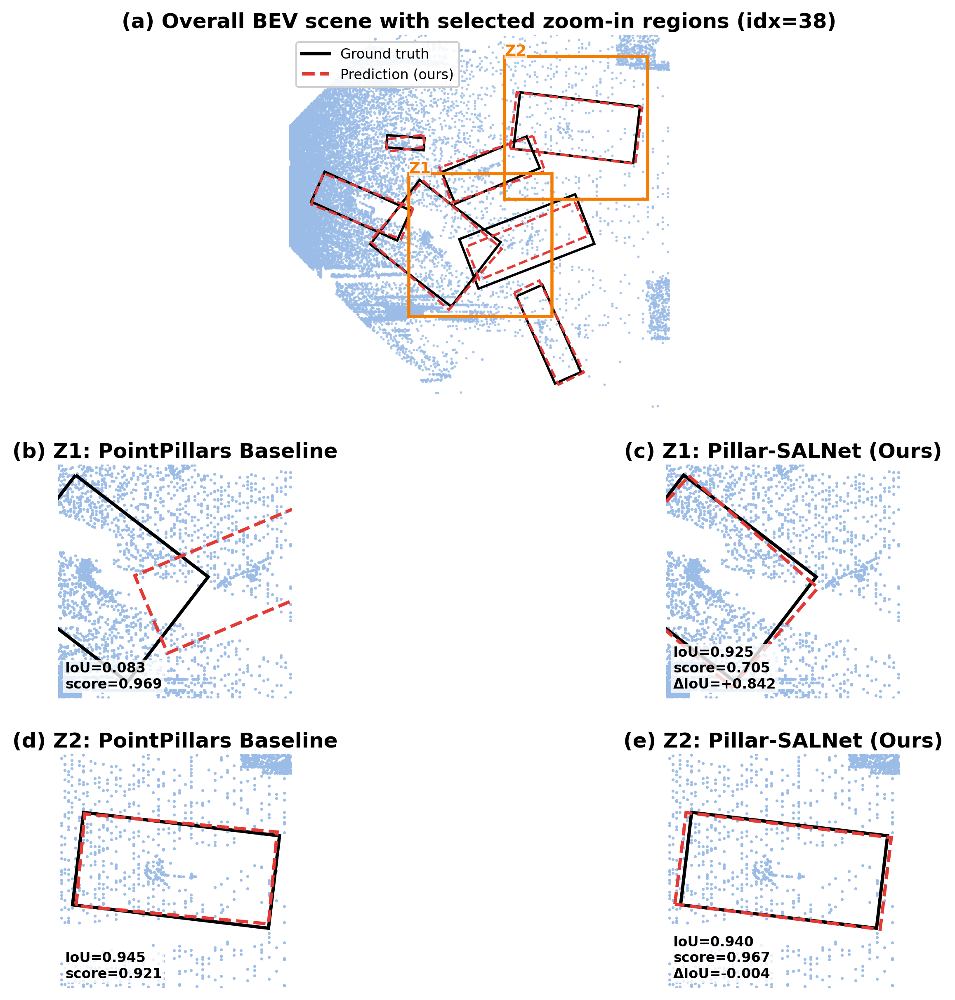
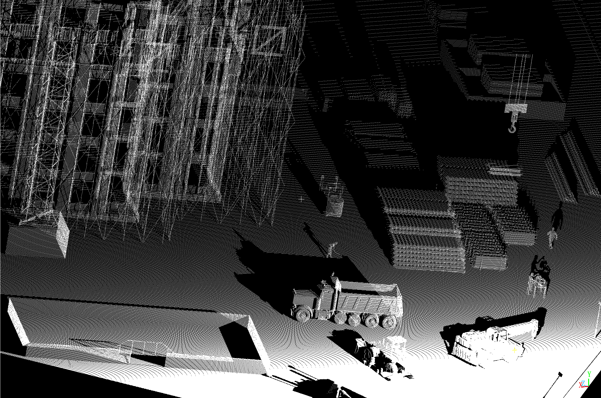
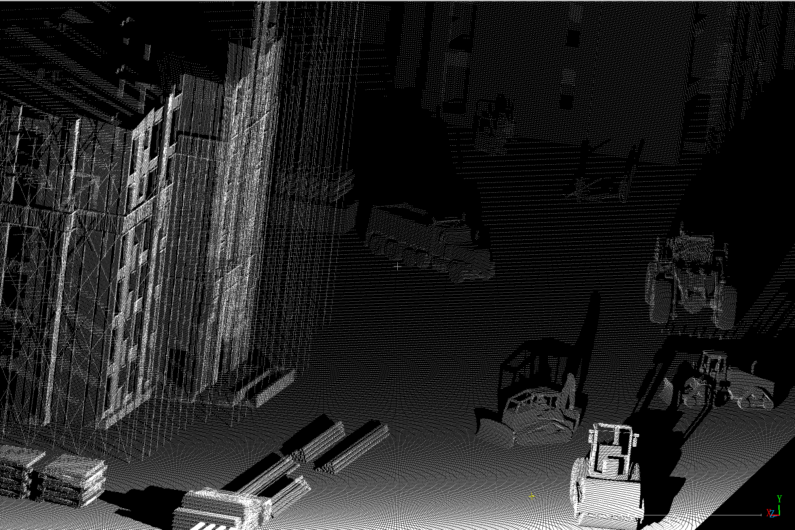
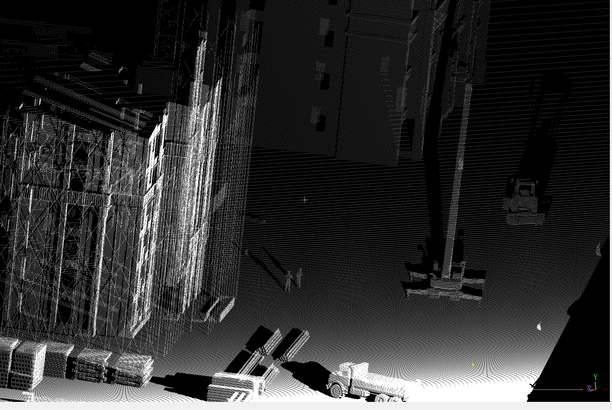

# VCVW-3DDet-Pillar-SALNet

🚧 **3D Detection of Construction Vehicles from Depth-Reconstructed Point Clouds via Pillar-SALNet**

---

## 📖 Introduction

This repository provides the official implementation of our work:

> **VCVW-3DDet: 3D Detection of Construction Vehicles from Depth-Reconstructed Point Clouds via Pillar-SALNet**

We propose a novel **Pillar-SALNet framework** to improve 3D object detection performance in construction scenarios by leveraging:

- Category-aware size priors
- Size-Aware Label Assignment (SALA)
- Lightweight channel attention (ECA)

---

## 🔥 Method Overview



The framework is built upon **PointPillars** and introduces:

- 📐 Geometry-aware anchor initialization
- 🎯 Adaptive label assignment (SALA)
- ⚡ Efficient feature enhancement (ECA)

---

## ⚙️ ECA Module



The Efficient Channel Attention (ECA) module enhances feature representation by:

- Capturing cross-channel interaction
- Avoiding dimensionality reduction
- Maintaining computational efficiency

---

## 📐 SALA Strategy



SALA dynamically adjusts the matching threshold according to object size:

- Improves supervision quality
- Handles large intra-class scale variation
- Reduces false negatives

---

## 📊 Experimental Results

| Method      | AP_R40 (%) | Params (M) | FPS   |
|-------------|------------|------------|-------|
| Baseline    | 66.70      | 4.93       | 26.67 |
| ECA         | 67.88      | 4.93       | 28.76 |
| SALA        | 67.34      | 4.93       | 26.67 |
| ECA + SALA  | **69.29**  | 4.93       | 28.76 |

> **Note:** Our method achieves the best performance while maintaining real-time efficiency.

---

## 🚗 BEV Detection Comparison

Representative BEV comparison results between the baseline detector and the proposed method are shown below.



**Visualization legend**
- Black boxes: Ground Truth
- Red dashed boxes: Predictions
- Blue points: Point Cloud

The proposed method produces more accurate localization and fewer false detections in representative construction scenes.

---

## 🌐 Point Cloud Reconstruction Examples

The point cloud data is reconstructed from depth images in the VCVW-3D virtual construction scene dataset.

### Example 1


### Example 2


### Example 3



These examples show that the reconstructed point clouds preserve the geometric structure of construction vehicles and surrounding environments, providing reliable input for 3D object detection.

---

## 📊 Dataset

The dataset is constructed based on the **VCVW-3D virtual construction scene dataset**.

- ❗ We do NOT distribute the original dataset
- This repo provides:
  - data format
  - processing pipeline
  - example usage

👉 Please obtain the dataset from official sources.

---

## ⚠️ License & Data Usage

- Dataset belongs to original VCVW-3D authors
- This repo **does NOT redistribute data**
- Only configs and processing scripts are provided

---

## 🚀 Training

### Train

```bash
python tools/train.py \
    --cfg_file tools/cfgs/vcvw_models/pointpillar_vcvw_5000.yaml \
    --batch_size 1 \
    --epochs 80 \
    --workers 0 \
    --fix_random_seed
```

 ## 🚀 Evaluation
```bash
python tools/test.py \
    --cfg_file tools/cfgs/vcvw_models/pointpillar_vcvw_5000.yaml \
    --ckpt path/to/your_checkpoint.pth
```


## 📂 Repository Structure

```text
VCVW-3DDet-Pillar-SALNet
├── cfgs        # configuration files
├── docs        # figures and documentation
├── tools       # training and testing scripts
├── data        # dataset description and examples
├── README.md
```


## 📌 Notes

```text
- Built upon the PointPillars framework
- Designed for construction vehicle detection
- Supports multi-scale feature fusion
- Introduces adaptive supervision strategy
```
